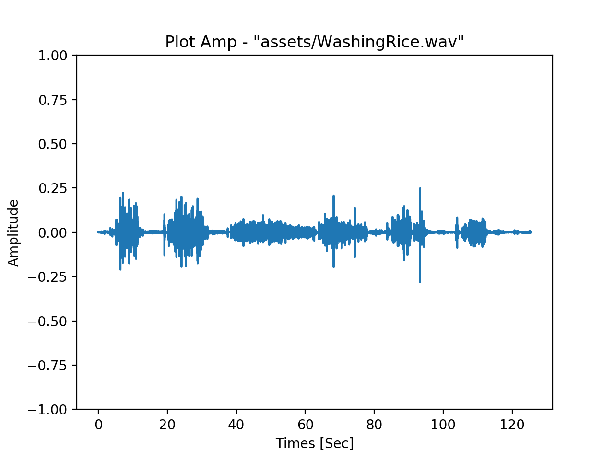
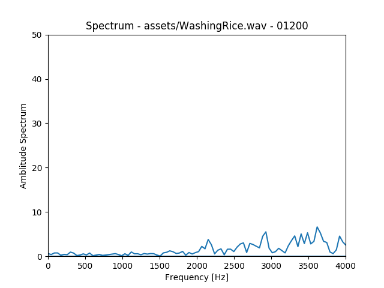

# AnalyzingSound_Rice  

### files  

- print_info.py // .wav の情報  
  ```
  - - - - -
  Channel : 2
  Width : 2
  Frame Rate : 44100 Hz
  Frame num :  5532672
  Total Time : 2 min 5.457414965986388 sec
  Tatal Time(sec) : 125.45741496598639 sec
  - - - - -
  ```

- plot_amp.py // amp X timeline  
    

- calc_fft_spectrum.py // amp X Hz (perFrame)  
  


---  


### wavelet 変換  

フーリエ変換は時間軸がない？  
ウェーブレット変換というものがある。  

>フーリエ解析においては、サイン波、コサイン波を拡大縮小して足し合わせることで入力を表現しようとしていたが、波が局在化していないため、時系列の情報が失われていた。  
(ウェーブレット変換 (wikipedia))
[https://ja.wikipedia.org/wiki/%E3%82%A6%E3%82%A7%E3%83%BC%E3%83%96%E3%83%AC%E3%83%83%E3%83%88%E5%A4%89%E6%8F%9B](wikipedia)


【Scipy】FFT、STFTとwavelet変換で遊んでみた♬～⑦リアルタイム・スペクトログラム(Qiita)  
[https://qiita.com/MuAuan/items/85b077640901dbb29514](https://qiita.com/MuAuan/items/85b077640901dbb29514)  


---  


### Ref  

22.4. wave — WAVファイルの読み書き  
[https://docs.python.jp/3/library/wave.html](https://docs.python.jp/3/library/wave.html)  

Pythonで科学計算ライブラリ「numpy」を用いて周波数解析(tomosoft)  
[https://tomosoft.jp/design/?p=11527](https://tomosoft.jp/design/?p=11527)  

Pythonを使って音声データからスペクトログラムを作成する(自調自考の旅)  
[https://own-search-and-study.xyz/2017/10/27/python%E3%82%92%E4%BD%BF%E3%81%A3%E3%81%A6%E9%9F%B3%E5%A3%B0%E3%83%87%E3%83%BC%E3%82%BF%E3%81%8B%E3%82%89%E3%82%B9%E3%83%9A%E3%82%AF%E3%83%88%E3%83%AD%E3%82%B0%E3%83%A9%E3%83%A0%E3%82%92%E4%BD%9C/](https://own-search-and-study.xyz/2017/10/27/python%E3%82%92%E4%BD%BF%E3%81%A3%E3%81%A6%E9%9F%B3%E5%A3%B0%E3%83%87%E3%83%BC%E3%82%BF%E3%81%8B%E3%82%89%E3%82%B9%E3%83%9A%E3%82%AF%E3%83%88%E3%83%AD%E3%82%B0%E3%83%A9%E3%83%A0%E3%82%92%E4%BD%9C/)  

Pythonで音の高速フーリエ変換（FFT）  
[http://denshi.blog.jp/signal_processing/python/fft](http://denshi.blog.jp/signal_processing/python/fft)  

【Python】WAVファイルを等間隔に分割するプログラム【サウンドプログラミング】  
[http://tacky0612.hatenablog.com/entry/2017/11/21/164409](http://tacky0612.hatenablog.com/entry/2017/11/21/164409)  

【Python】複数のWAVファイルの波形を表示するプログラム【サウンドプログラミング】  
[http://tacky0612.hatenablog.com/entry/2017/11/28/133103](http://tacky0612.hatenablog.com/entry/2017/11/28/133103)

【Python】WAVファイルの波形データにFFTかけて周波数スペクトルを複数表示する【サウンドプログラミング】  
[http://tacky0612.hatenablog.com/entry/2017/12/12/174405](http://tacky0612.hatenablog.com/entry/2017/12/12/174405)  

PythonのWaveモジュールを使ってwavファイルを編集する（Qiita）  
情報を表示  
[https://qiita.com/niisan-tokyo/items/d25dada3fa9903862260](https://qiita.com/niisan-tokyo/items/d25dada3fa9903862260)  

短時間フーリエ変換（ハミング窓、窓関数について）  
[http://aidiary.hatenablog.com/entry/20110716/1310824587](http://aidiary.hatenablog.com/entry/20110716/1310824587)


### Ref : wavelet  
【Scipy】FFT、STFTとwavelet変換で遊んでみた♬～⑦リアルタイム・スペクトログラム(Qiita)  
[https://qiita.com/MuAuan/items/85b077640901dbb29514](https://qiita.com/MuAuan/items/85b077640901dbb29514)  